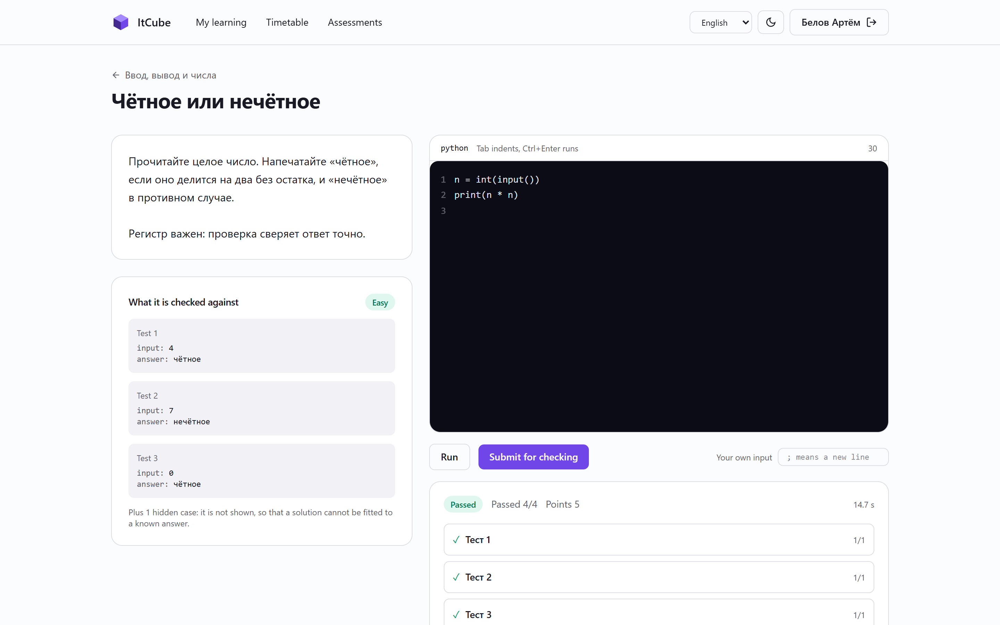
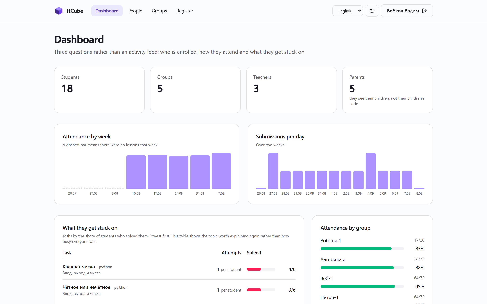
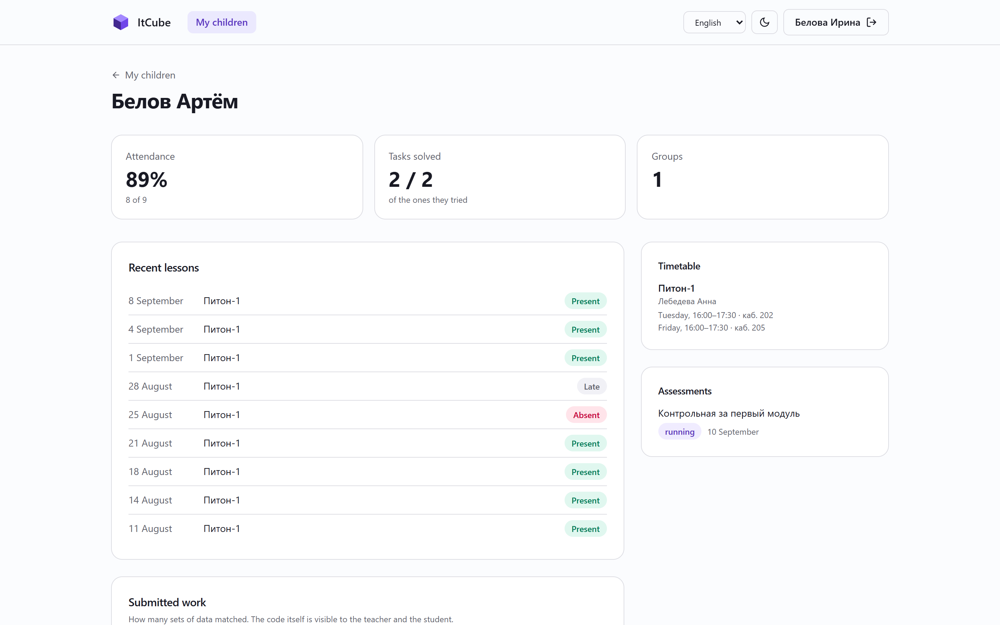
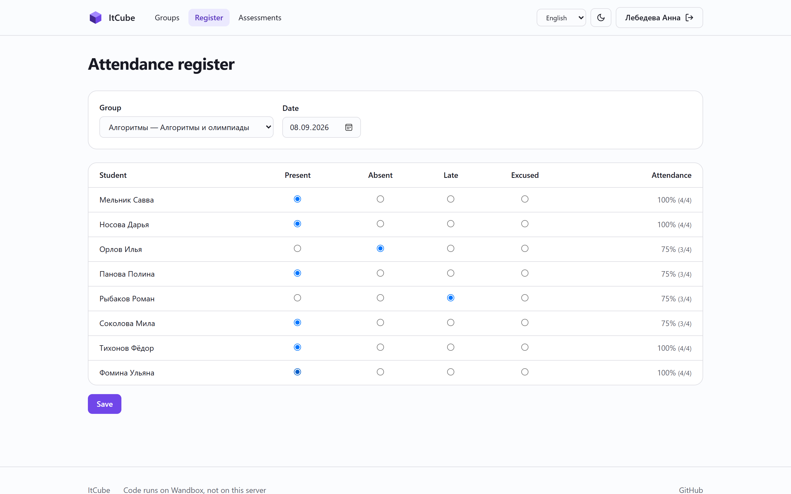
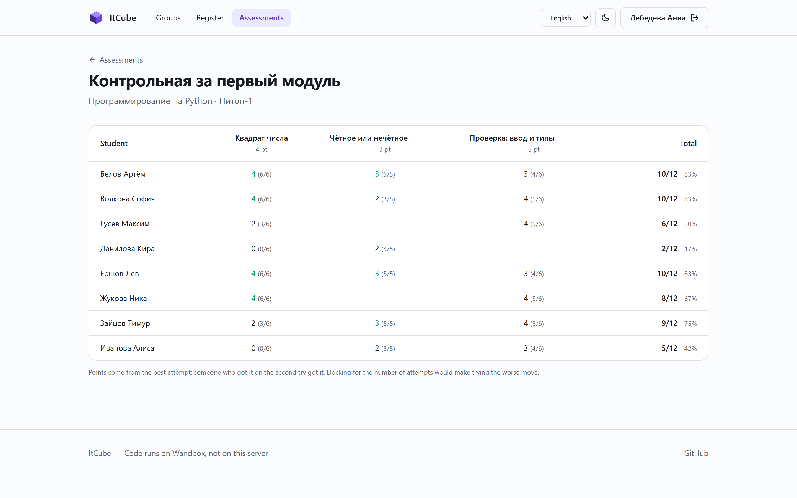
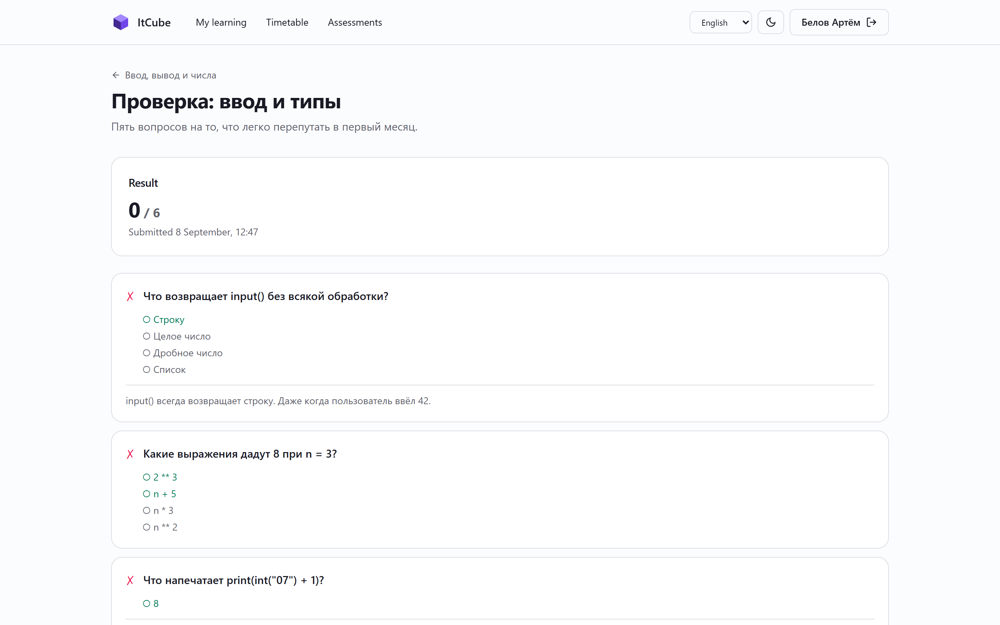
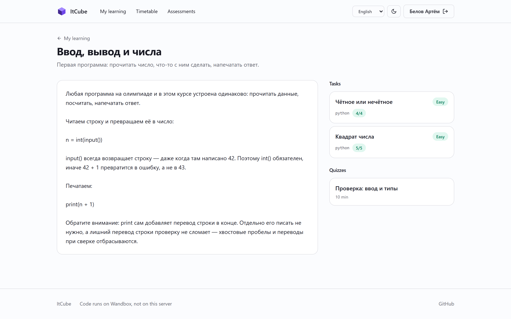
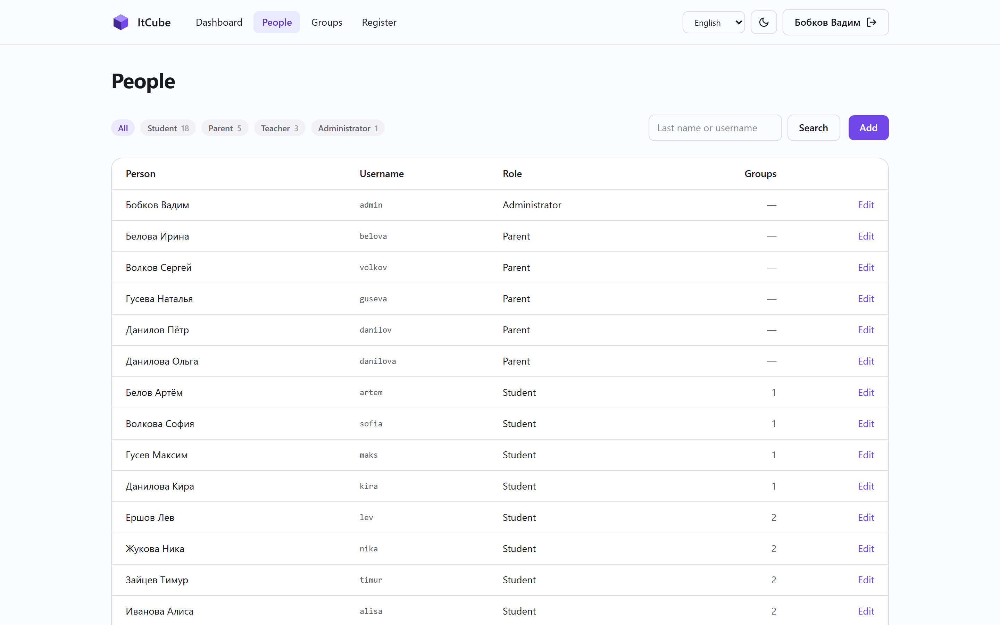
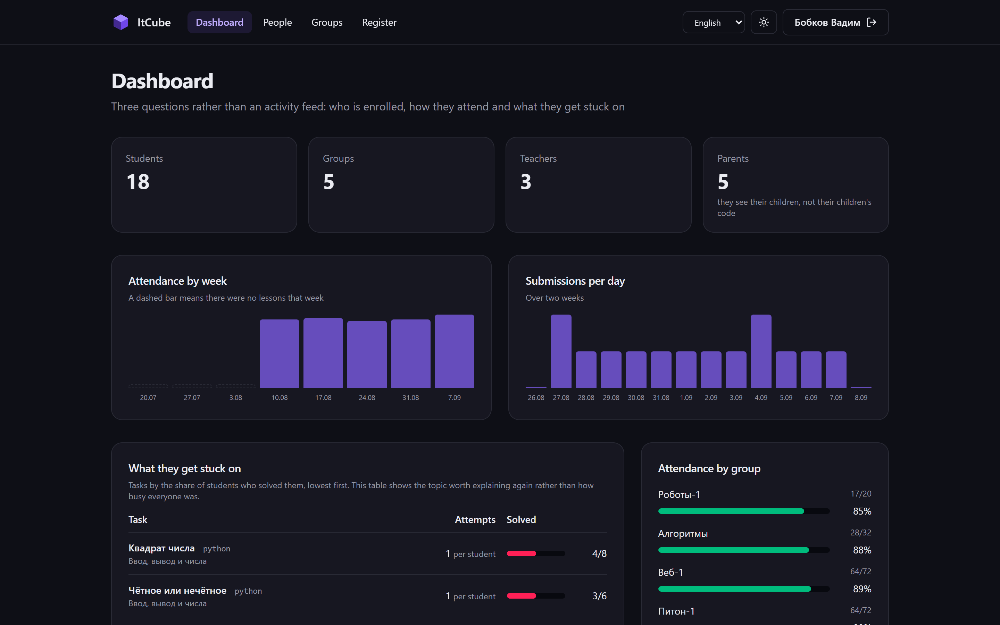

# ItCube

A platform for a small coding school: tracks, groups, timetable, attendance
register — and coding tasks that check themselves.

Русский: [README.ru.md](README.ru.md)



The first version was written in 2023: procedural PHP, two separate login
flows, attendance stored as a pair of student and date with no group, and file
uploads that took the extension from the filename and dropped the file into a
served directory. This version is a rewrite on Laravel. Only the domain
survived.

## What it does

**Runs student code in fourteen languages.** Python, JavaScript, TypeScript,
PHP, C, C++, Java, C#, Go, Rust, Ruby, Pascal, SQL and Bash. There is no
sandbox here and there never will be: code goes to [Wandbox](https://wandbox.org),
which already runs untrusted code for a living. A school platform has no
business maintaining that infrastructure itself.

One backend rather than several is not a simplification. The Go Playground does
not accept stdin, and without stdin there is no such thing as a test case with
input data — which means no assessment worth the name.

**Checks against several sets of data, not one.** A task carries test cases,
each with its own input, expected output and points. Some are hidden: the
student sees only whether a hidden case passed, never its input or its expected
answer. Otherwise a solution gets fitted to the known answer instead of being
made to work.

**Grades in the background.** Submitting queues the work and the page polls for
the result. That is not architecture for its own sake — measured: five test
cases in Go take about a minute, because one build on the playground runs for
roughly twenty seconds. Cases are sent in parallel; a synchronous request would
have to hold the connection open the whole time.

**Quizzes with a timer** that submits the answers on its own when time runs
out, and **assessments** that combine quizzes and coding tasks into one graded
paper with an open window.

**An attendance register** that records the group, so a student enrolled in two
tracks is no longer indistinguishable on the same day. The 2023 schema could
not tell those apart.

**A dashboard that answers questions rather than counting things.** The table
that matters lists tasks by the share of students who solved them, lowest
first: it points at the topic worth explaining again, which no activity counter
ever does. Beside it: attendance by week and by group, submissions per day, the
quiz questions people get wrong most often, and which languages get used. It is
computed with grouped queries, and the charts are drawn in markup, because two
charts do not justify a charting library.

**A parent's view.** An adult linked to a student sees attendance, results,
the timetable and assessments. They do not see their child's code, on purpose:
the questions a parent has are whether the child turns up and whether they are
keeping up, and going through a solution is the teacher's job. The link is
many-to-many, because a child can have two adults and an adult two children in
different groups.

**Three languages.** Russian, English and German, in the gettext style: the
translation key is the source string itself, so anything untranslated stays
readable text rather than a key name in the middle of the page. Adding a
language means translating one JSON file. `php artisan lang:check` compares the
dictionaries against the code, and a test keeps them from drifting apart.

## Screenshots

| | |
|---|---|
|  The dashboard |  A parent's view of one child |
|  Attendance register |  Assessment sheet |
|  Quiz with a timer |  A lesson |
|  People and roles |  Dark theme |

The interface is shown in English here; the Russian one is in
[README.ru.md](README.ru.md). Group names, lesson titles and task text stay in
Russian in both, because they are one school's own content rather than interface
strings.

## Running it

PHP 8.3+, Composer and PostgreSQL.

```bash
git clone https://github.com/dripips/ItCube.git
cd ItCube
composer install
npm install && npm run build
cp .env.example .env
php artisan key:generate
createdb itcube
php artisan migrate --seed
php artisan serve
```

The seed builds a demo school: four tracks, five groups, eighteen students,
lessons with real tasks, a quiz, an assessment and a month of attendance.
Everyone's password is `password`. Sign in as `admin` for the dashboard,
`lebedeva` for the teacher's side, `artem` for a student's, or `belova` for a
parent with two children in different groups.

Grading runs on a queue, so start a worker too:

```bash
php artisan queue:work
```

No accounts or keys are needed for any third-party service — Wandbox works
without registration.

## Tests

```bash
php artisan test
```

Sixty-eight tests. None of them touch the network: HTTP is faked, so the suite
does not depend on somebody else's uptime.

## What is not here

No file manager yet. Tracks and subjects are still seeded rather than edited
in the panel; people, groups and timetables are editable there.

The blocklists in `CodeRunner` are politeness, not isolation. They stop the
obvious nonsense before the network request so that a student gets a clear
answer instead of a timeout. What makes this safe is that the code does not run
on your server.

## Licence

MIT.
