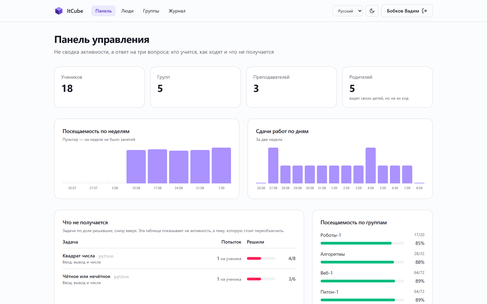
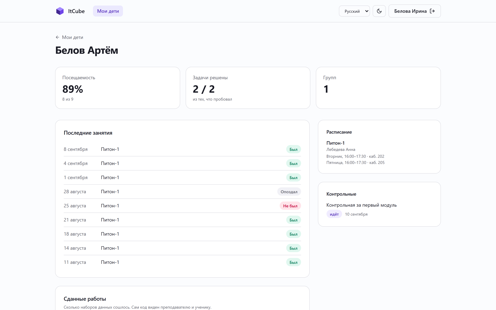
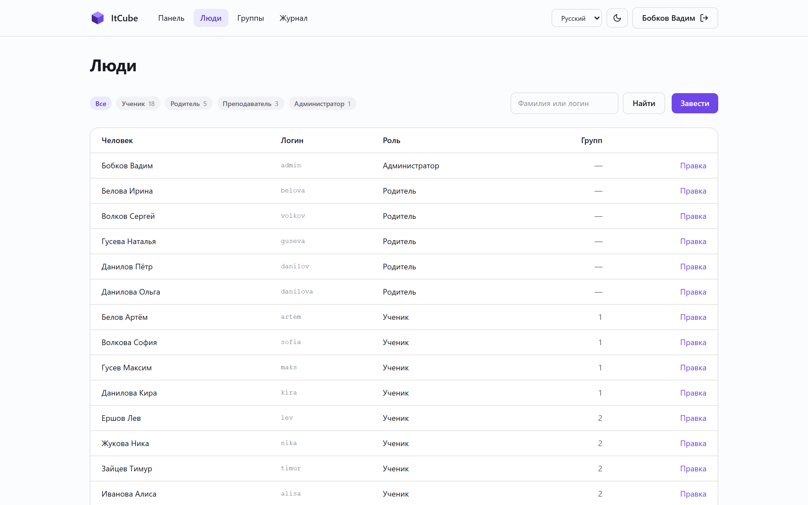
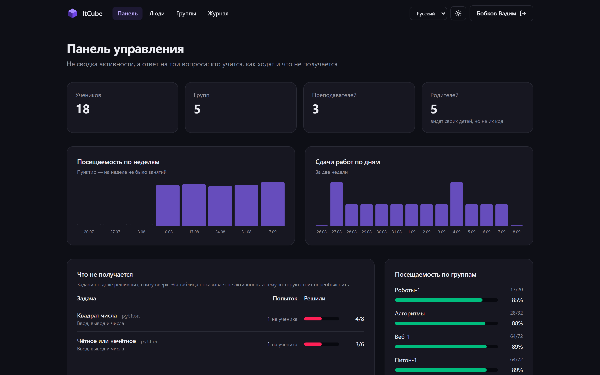

# ItCube

Платформа для учебного центра: направления, группы, расписание, журнал — и
задачи с кодом, которые проверяются сами.

English: [README.md](README.md)


Первая версия жила в 2023 году: процедурный PHP, два отдельных входа — свой для
преподавателя и свой для ученика, посещаемость парой «ученик и дата» без группы
и загрузка файлов с расширением из собственного имени в раздаваемую папку. Эта
версия переписана с нуля на Laravel. От старой досталась только предметная
область.

## Что умеет

**Запускает код на четырнадцати языках.** Python, JavaScript, TypeScript, PHP,
C, C++, Java, C#, Go, Rust, Ruby, Паскаль, SQL и Bash. Своей песочницы нет и не
планируется: код уходит на [Wandbox](https://wandbox.org), который держит
инфраструктуру для запуска недоверенного кода профессионально. Школьной
платформе такое хозяйство не по средствам.

Одна площадка вместо нескольких выбрана не ради простоты. Go Playground не
принимает stdin, а без stdin не существует тест-кейса с входными данными —
значит, не существует и настоящей контрольной.

**Проверяет по нескольким наборам данных, а не по одному.** У задачи есть
тест-кейсы, у каждого свой вход, свой ожидаемый ответ и свои баллы. Часть
кейсов скрытая: ученик видит только «сошёлся или нет», без входа и без
ожидаемого ответа. Иначе решение подгоняют под известный ответ вместо того,
чтобы заставить его работать.

**Проверяет в фоне.** Сдача уходит в очередь, страница опрашивает результат.
Это не архитектура ради архитектуры, а следствие замера: пять кейсов на Go
занимают около минуты, потому что одна сборка на площадке идёт примерно
двадцать секунд. Кейсы отправляются параллельно, но синхронный запрос всё равно
пришлось бы держать открытым всё это время.

**Тесты с таймером**, который сам отправляет ответы по истечении времени, и
**контрольные**, собирающие тесты и задачи с кодом в одну работу с окном сдачи.

**Журнал посещаемости**, где отметка привязана к группе: ученик, который ходит
на два направления, больше не сливается в один день. Схема 2023 года такое
различить не могла.

**Панель, которая отвечает на вопросы, а не считает.** Главная таблица там —
задачи по доле решивших, снизу вверх: она показывает тему, которую стоит
переобъяснить, чего не сделает ни один счётчик активности. Рядом посещаемость
по неделям и по группам, сдачи по дням, вопросы теста с самой низкой долей
верных ответов и разбивка по языкам. Считается запросами с группировкой,
графики нарисованы разметкой — две диаграммы не окупают библиотеку.

**Кабинет родителя.** Взрослый, привязанный к ученику, видит посещаемость,
результаты, расписание и контрольные. Кода ребёнка он не видит намеренно: у
родителя вопросы «ходит ли» и «справляется ли», а разбор решения — дело
преподавателя. Связь многие-ко-многим, потому что у ребёнка бывает двое
взрослых, а у взрослого двое детей в разных группах.

**Три языка.** Русский, английский и немецкий, по схеме gettext: ключ перевода
— сама русская строка, поэтому непереведённое место остаётся читаемым текстом,
а не именем ключа посреди страницы. Добавить язык — перевести один JSON.
Команда `php artisan lang:check` сверяет словари с кодом, а тест не даёт им
разъехаться.

## Как выглядит

| | |
|---|---|
|  Панель управления |  Родитель об одном ребёнке |
|  Журнал |  Ведомость по контрольной |
|  Тест с таймером |  Занятие |
|  Люди и роли |  Тёмная тема |

## Запуск

Нужны PHP 8.3+, Composer и PostgreSQL.

```bash
git clone https://github.com/dripips/ItCube.git
cd ItCube
composer install
npm install && npm run build
cp .env.example .env
php artisan key:generate
createdb itcube
php artisan migrate --seed
php artisan serve
```

Наполнение поднимает демонстрационный центр: четыре направления, пять групп,
восемнадцать учеников, пятеро взрослых, занятия с настоящими задачами, тест,
контрольная и месяц посещаемости. Пароль у всех `password`: панель управления —
`admin`, преподаватель — `lebedeva`, ученик — `artem`, родитель с двумя детьми
в разных группах — `belova`.

Проверка идёт в очереди, поэтому нужен ещё обработчик:

```bash
php artisan queue:work
```

Учётных записей и ключей у сторонних сервисов не требуется: Wandbox работает
без регистрации.

## Тесты

```bash
php artisan test
```

Шестьдесят восемь тестов. В сеть не ходит ни один: HTTP подменяется, поэтому
набор не зависит от чужой доступности.

## Чего нет

Файлового менеджера. Направления и предметы пока заводятся наполнением, а не
в панели; люди, группы и расписание там правятся.

Списки запрещённых конструкций в `CodeRunner` — не изоляция, а вежливость. Они
отсекают явную дурь до сетевого запроса, чтобы ученик получил внятный ответ
вместо таймаута. Безопасность обеспечивает то, что код исполняется не у нас.

## Лицензия

MIT.
